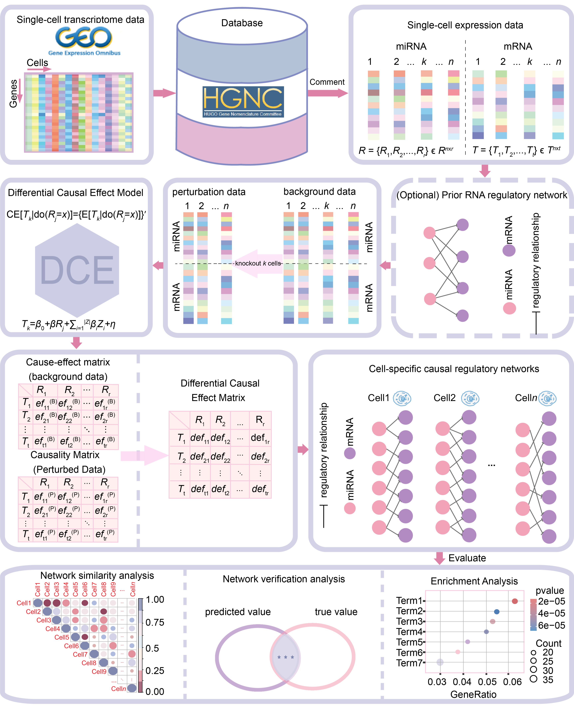

# 🧬 DCEmiR

**DCEmiR: A Method for Identifying Cell-Specific microRNA Causal Regulatory Networks**

# 📰 Background

In the gene regulation field, miRNA regulation has attracted broad attention due to its potential for clinical translation. However, cancer cells exhibit significant heterogeneity, and miRNA regulatory functions can differ markedly across cell types or even within the same cell under varying conditions. To decipher the molecular mechanisms underlying this heterogeneity, researchers have developed numerous methods for constructing gene regulatory networks (GRNs) using bulk transcriptomic data. While these approaches are valuable, they only capture average regulatory levels across cell populations, failing to reveal cell-specific regulatory heterogeneity. Emerging single-cell methods have begun to address this gap, yet they remain limited by their reliance on correlation-based analyses and lack of causal inference capabilities, with the inherent noise and sparsity of single-cell data further compromising network accuracy.

To overcome these limitations, we propose DCEmiR, a novel method for identifying cell-specific miRNA-mRNA causal regulatory networks at single-cell resolution. By integrating single-cell transcriptomic data with prior knowledge of miRNA-target interactions and accounting for inter-cellular heterogeneity, DCEmiR constructs personalized causal regulatory networks at the individual cell level. We applied this method to single-cell datasets from hepatocellular carcinoma and leukemia, systematically characterizing miRNA regulatory networks and revealing key causal pathways across cancer cells. Our findings provide theoretical and methodological support for personalized cancer diagnosis and therapy, with potential applications in early detection, prognosis, drug target discovery, and regenerative medicine.

A schematic illustration of **DCEmiR** is shown in the folowing.  For single-cell transcriptomic data, whether or not they contain prior information on miRNA–mRNA interactions, DCEmiR first screens genes based on existing prior knowledge (where available). Subsequently, using a perturbation strategy, DCEmiR removes cells one by one to construct a control group (background data) and n experimental groups (perturbed data). These n+1 datasets are then processed using a differential causal effects model to generate n+1 causal matrices. By subtracting the corresponding coefficients from the background data from the causal effect coefficients of each perturbation dataset, DCEmiR obtains a differential causal matrix for each cell and visualises it as n directed single-cell gene regulatory network topologies for individual cells.

# 📁 Description of each file in R and Data folders

-   

-   

-   

# 📌 The usage of DCEmiR

Paste all files into a single folder (set the folder as the directory of R environment). The users can simply run the scripts as follows.

``` r
source("R/Case_study.R")
```

# 🚀 Quick example to use DCEmiR

To identify cell-specific microRNA causal regulatory networks, users need to prepare matched miRNA and mRNA expression data, along with putative miRNA-target interactions (optional). Place the datasets and our source script (DCEmiR.R) into a single folder, and set this folder as the R working directory. Then, run the following scripts to perform the analysis. For convenience, we have prepared single-cell transcriptomics datasets and putative miRNA-target interactions for users, which can be downloaded here.

``` r
```
